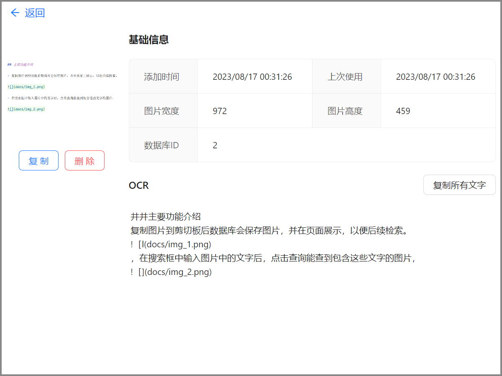

# windows-clipboard-image-helper

Windows剪切板图片工具

完全本地化，无需联网。目前功能还在逐渐完善中。

打包产物：[https://github.com/ConanYu/windows-clipboard-image-helper/releases](https://github.com/ConanYu/windows-clipboard-image-helper/releases)

## 主要功能介绍

- 复制图片到剪切板后数据库会保存图片，并在页面上展示，以便后续检索。

- 在搜索框中输入图片中的文字后，点击查询能查到包含这些文字的图片。

## 为什么做

[Ditto](https://github.com/sabrogden/Ditto)是一个我经常使用的效率工具，能将复制的内容存储在数据库中，以便以后检索。

但是缺少图片OCR的功能，并且制作这个工具的团队认为支持图片OCR功能是艰巨的任务。参考：[https://github.com/sabrogden/Ditto/issues/247](https://github.com/sabrogden/Ditto/issues/247)

于是我简单做了一个独立的工具，用于支持这个剪切板+OCR的功能。

## 技术设计

主要使用第三方库或工具：

- [tauri](https://tauri.app/)：用于客户端页面展示
- [PaddleOCR-json](https://github.com/hiroi-sora/PaddleOCR-json)：用于离线图片文字识别
- [ant-design](https://ant.design/)：前端页面展示组件来源
- [winapi-rs](https://github.com/retep998/winapi-rs)：方便Windows API使用
- [rusqlite](https://github.com/rusqlite/rusqlite)：使用SQLite进行数据存储

## 常见问题

- 为什么只做windows？

因为这个工具涉及很多操作系统的API，只做一个操作系统比较好做。并且目前[PaddleOCR-json](https://github.com/hiroi-sora/PaddleOCR-json)也只支持Windows，本工具需要一个开箱即用的OCR工具。

- 为什么用[PaddleOCR-json](https://github.com/hiroi-sora/PaddleOCR-json)？

因为没找到其他开箱即用的OCR工具。

## TodoList

- 多开检测
- 目前前端展示速度很慢
- 加上快捷键功能
- 加上二维码功能
